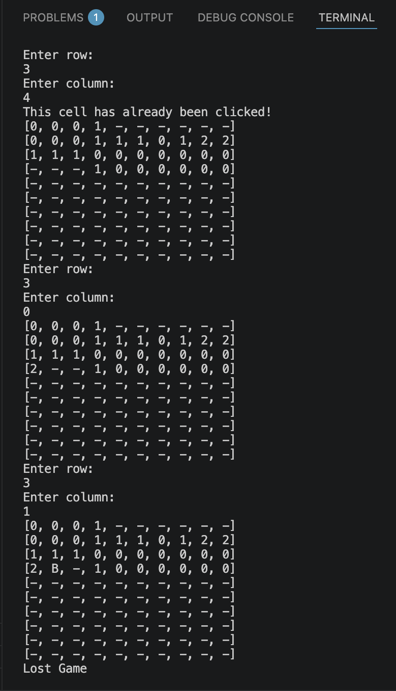

# Minesweeper

## Overview

A simplified version of the classic Minesweeper game built in Java and played through the Terminal.

The player selects coordinates on a 10x10 grid to reveal cells while avoiding randomly generated mines. Each revealed cell displays the number of surrounding mines.

## Screenshot

## Features

- Generates a 10x10 game board
- Randomly places mines
- Calculates surrounding mine numbers
- Allows players to reveal cells using coordinates
- Tracks revealed cells
- Detects when a mine is selected or all empty cells are revealed

## Java Concepts

- Object-oriented programming (Classes and Objects)
- Encapsulation
- ArrayLists and nested collections
- Loops and conditional logic
- User input with Scanner

## Technologies

- Java
- Git & GitHub
